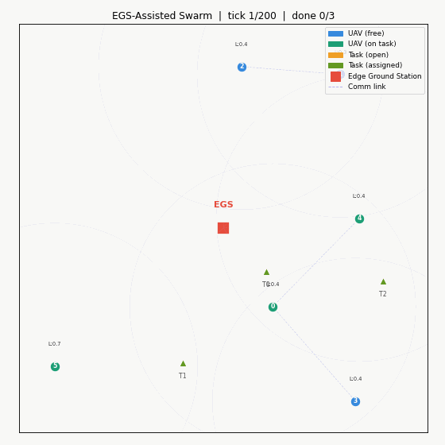

# Decentralized UAV Swarm Task Allocation under Edge Compute Constraints

A simulation framework benchmarking **local-consensus task allocation** against greedy and centralized-oracle baselines for autonomous UAV swarms operating at the network edge — motivated by recent work on agentic AI in UAV swarms and edge-cloud computation offloading.



## Motivation

Deploying intelligent task allocation to edge-constrained UAV swarms raises a key challenge: centralized approaches (e.g., Hungarian-algorithm base-station solvers) require every agent to upload its state and receive assignments, incurring O(N) global broadcasts per round. In bandwidth-limited or intermittently connected environments, this is infeasible.

This project proposes and evaluates a **LocalConsensus** algorithm in which each UAV bids on open tasks using only information exchanged with in-range neighbors. No global broadcast is needed. We compare three allocation strategies:

| Algorithm | Communication model | Coordination |
|---|---|---|
| **EGS-Assisted** (proposed) | Local bids + EGS validation | Hybrid (Edge-Cloud) |
| LocalConsensus | k-hop neighborhood only | Decentralized |
| GreedyBaseline | Zero inter-UAV messages | None |
| CentralizedOracle | Full state upload + global broadcast | Centralized |

## Results


Benchmark outputs depend heavily on the seed, swarm size, task rate, and communication range. Rather than pinning one stale table in the README, the project saves reproducible per-episode metrics to `results/metrics.json` and can regenerate plots with:

```bash
python simulate.py
python visualize.py --mode results
```

The benchmark now applies compute-load reservation and edge-offload latency directly inside the simulation loop, so mobility throttling, edge delay, and EGS corrections affect runtime behavior instead of only post-hoc reporting.

## Project Structure

```
uav_swarm/
├── env.py          # SwarmEnv: UAV and task physics, mobility-compute coupling
├── consensus.py    # LocalConsensus, GreedyBaseline, CentralizedOracle
├── edge.py         # EGSAssistedConsensus, OffloadingModel, EGS Validator
├── simulate.py     # Episode runner, metrics collector, benchmark table
├── visualize.py    # matplotlib animation and result charts
├── results/
│   ├── metrics.json            # raw benchmark data
│   ├── benchmark_results.png   # bar charts
│   └── swarm1.gif              # simulation animation
└── requirements.txt
```

## Installation

```bash
git clone https://github.com/<your-username>/uav-swarm-edge-ai
cd uav-swarm-edge-ai
pip install -r requirements.txt
```

## Usage

**Run the full benchmark (all 4 algorithms):**
```bash
python simulate.py
```

**Custom configuration:**
```bash
python simulate.py --n_uavs 8 --area 120 --ticks 500 --episodes 20 --comm_range 40
```

**Single algorithm:**
```bash
python simulate.py --algo local
```

**Live animation:**
```bash
python visualize.py --mode animate --n_uavs 6
```

**Plot results from saved metrics:**
```bash
python visualize.py --mode results
```

## Algorithm Details

### LocalConsensus

Each allocation round proceeds as follows:

1. Each UAV broadcasts a **bid** `(task_id, cost)` to all in-range neighbors, where:
   ```
   cost(UAV_i, Task_j) = 0.6 × dist(i, j) + 0.4 × compute_load(i)
   ```
2. Within each neighborhood, the **lowest-cost bidder wins** the task.
3. No message leaves the local neighborhood — the base station is not involved.

Messages per round: **O(k)** where k = mean neighborhood size, vs. **O(N)** for the centralized oracle.

### Communication model

UAVs communicate over a fixed radio range `comm_range`. Connectivity varies with UAV positions — in sparse deployments some UAVs may be temporarily isolated, in which case they fall back to self-assignment (mirroring real edge-device behavior under intermittent connectivity).

## Relation to Recent Research

This simulation is directly motivated by:

- *"Agentic AI Meets Edge Computing in Autonomous UAV Swarms"* — IEEE IoT Magazine, 2026: the challenge of coordinating autonomous UAV agents without centralized control.
- *"Integrated Computation Offloading, UAV Trajectory Control, Edge-Cloud and Radio Resource Allocation in SAGIN"* — IEEE Transactions on Cloud Computing, 2024: compute-load-aware allocation under edge constraints.

Planned extensions include: reinforcement-learning-based bidding policies, failure recovery under UAV dropout, and integration with semantic communication channels.

## License

MIT
