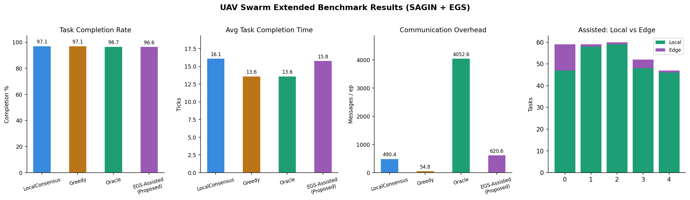

# Decentralized UAV Swarm Task Allocation under Edge Compute Constraints

A simulation framework benchmarking **local-consensus task allocation** against greedy and centralized-oracle baselines for autonomous UAV swarms operating at the network edge — motivated by recent work on agentic AI in UAV swarms and edge-cloud computation offloading.


## Motivation

Deploying intelligent task allocation to edge-constrained UAV swarms raises a key challenge: centralized approaches (e.g., Hungarian-algorithm base-station solvers) require every agent to upload its state and receive assignments, incurring O(N) global broadcasts per round. In bandwidth-limited or intermittently connected environments, this is infeasible.

This project proposes and evaluates a **LocalConsensus** algorithm in which each UAV bids on open tasks using only information exchanged with in-range neighbors. No global broadcast is needed. We compare four allocation strategies:

| Algorithm | Communication model | Coordination |
|---|---|---|
| **EGS-Assisted** (proposed) | Local bids + EGS validation | Hybrid (Edge-Cloud) |
| LocalConsensus | k-hop neighborhood only | Decentralized |
| GreedyBaseline | Zero inter-UAV messages | None |
| CentralizedOracle | Full state upload + global broadcast | Centralized |

## Results



Benchmark outputs depend heavily on the seed, swarm size, task rate, and communication range. Rather than pinning one stale table in the README, the project saves reproducible per-episode metrics to `results/metrics.json` and can regenerate plots with:

```bash
python simulate.py
python visualize.py --mode results
```

Representative benchmark configuration used for the summary below:

```bash
python simulate.py --episodes 30 --ticks 500 --n_uavs 8
```

## BENCHMARK SUMMARY (SAGIN + EGS Extensions)

| Algorithm                         | Comp% | Time (t) | Msgs/ep | Edge% | Corrs | Dist/U |
|----------------------------------|-------|----------|---------|-------|-------|--------|
| LocalConsensus (proposed)         | 96.8% | 16.8     | 532     | 6.9%  | 0.0   | 156.8  |
| GreedyBaseline (no coordination) | 96.7% | 13.2     | 57      | 12.2% | 0.0   | 119.8  |
| CentralizedOracle (upper bound)  | 97.1% | 13.2     | 4054    | 6.9%  | 0.0   | 123.4  |
| EGS-Assisted Consensus (proposed)| 95.7% | 17.2     | 597     | 4.1%  | 1.8   | 162.3  |

The benchmark now applies compute-load reservation and edge-offload latency directly inside the simulation loop, so mobility throttling, edge delay, and EGS corrections affect runtime behavior instead of only post-hoc reporting.

For communication accounting, the `CentralizedOracle` baseline models a continuously monitoring base station with full-state uploads each tick, while `LocalConsensus` and the EGS validation layer are event-driven and only communicate when local bidding or correction-worthy assignments occur. This asymmetry is intentional: it reflects the architectural contrast between always-on centralized coordination and lightweight onboard agents with occasional edge assistance.

Over 30 episodes, `LocalConsensus` is statistically comparable to `CentralizedOracle` on completion rate (Welch's t-test `p = 0.66`) while using about 86.9% fewer messages per episode. That is the main empirical result of the project.

In dense settings, the simple greedy baseline can also perform surprisingly well because many tasks are near some free UAV. Here, `GreedyBaseline` is also statistically comparable to `LocalConsensus` on completion rate (`p = 0.95`) while being faster and much cheaper in communication. The stronger claim here is therefore not that `LocalConsensus` always beats greedy, but that it can match centralized quality without relying on global broadcasts and remains a fully decentralized control path.

The `LocalConsensus` message count grows with fleet size and mean neighborhood degree because each open-task bid is broadcast to in-range peers. In the 8-UAV benchmark above, the average `532.2` messages per episode come entirely from local bid exchanges rather than hidden global traffic.

`EGS-Assisted` is best understood as a hybrid reliability-monitoring variant rather than the throughput winner in this benign dense regime. Its edge layer stays lightweight and event-driven, averaging about 50.4 validation rounds, 55.1 EGS uploads, 5.8 EGS downlinks, 1.8 overload corrections, and 2.2 forced offloads per episode. In the current environment those correction events are too rare for the extra layer to outperform plain `LocalConsensus`, but the same instrumentation is intended to matter more under higher task rates, lower UAV density, or harsher connectivity.

## Project Structure

```
uav_swarm/
├── env.py          # SwarmEnv: UAV and task physics, mobility-compute coupling
├── consensus.py    # LocalConsensus, GreedyBaseline, CentralizedOracle
├── edge.py         # EGSAssistedConsensus, OffloadingModel, EGS Validator
├── simulate.py     # Episode runner, metrics collector, benchmark table
├── visualize.py    # matplotlib animation and result charts
├── results/
│   ├── metrics.json            # raw benchmark data
│   ├── benchmark_results.png   # bar charts
│   └── swarm1.gif              # simulation animation
└── requirements.txt
```

## Installation

```bash
git clone https://github.com/hthangnguyen/SwarmEdge-SAGIN.git
cd SwarmEdge-SAGIN-main
pip install -r requirements.txt
```

## Usage

**Run the full benchmark (all 4 algorithms):**
```bash
python simulate.py
```

**Custom configuration:**
```bash
python simulate.py --n_uavs 8 --area 120 --ticks 500 --episodes 20 --comm_range 40
```

**Single algorithm:**
```bash
python simulate.py --algo local
```

**Live animation:**
```bash
python visualize.py --mode animate --n_uavs 6
```

**Plot results from saved metrics:**
```bash
python visualize.py --mode results
```

## Algorithm Details

### LocalConsensus

Each allocation round proceeds as follows:

1. Each UAV broadcasts a **bid** `(task_id, cost)` to all in-range neighbors, where:
   ```
   cost(UAV_i, Task_j) = 0.6 × dist(i, j) + 0.4 × compute_load(i)
   ```
2. Within each neighborhood, the **lowest-cost bidder wins** the task.
3. No message leaves the local neighborhood — the base station is not involved.

Messages per round: **O(k)** where k = mean neighborhood size, vs. **O(N)** for the centralized oracle.

### Communication model

UAVs communicate over a fixed radio range `comm_range`. Connectivity varies with UAV positions — in sparse deployments some UAVs may be temporarily isolated, in which case they fall back to self-assignment (mirroring real edge-device behavior under intermittent connectivity).

## Relation to Recent Research

This simulation is directly motivated by:

- *"Agentic AI Meets Edge Computing in Autonomous UAV Swarms"* — IEEE IoT Magazine, 2026: the challenge of coordinating autonomous UAV agents without centralized control.
- *"Integrated Computation Offloading, UAV Trajectory Control, Edge-Cloud and Radio Resource Allocation in SAGIN"* — IEEE Transactions on Cloud Computing, 2024: compute-load-aware allocation under edge constraints.

Planned extensions include: reinforcement-learning-based bidding policies, failure recovery under UAV dropout, and integration with semantic communication channels.

## License

MIT
